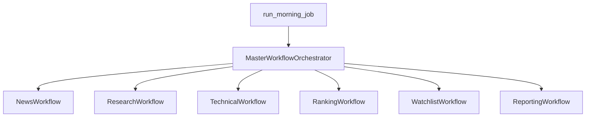

# Modular Workflow Architecture

Engineering handoff document for the Morning Trading Agent modular workflow refactor.

## Overview

The monolithic 17-node LangGraph pipeline is now organized into **six composable workflows** orchestrated by `MasterWorkflowOrchestrator`. Business logic (ranking formulas, gate thresholds, watchlist selection) is unchanged unless explicitly enabled via feature flags for agent phases.

## Architecture



### Workflow modules

| Workflow | Nodes | Output contract |
|----------|-------|-----------------|
| **News** | `fetch_news`, `filter_articles` | `NewsWorkflowResult` |
| **Research** | `extract_stocks`, `analyze_news`, `enrich_catalyst_quality` | `ResearchWorkflowResult` |
| **Technical** | `technical_analysis` | `TechnicalWorkflowResult` |
| **Ranking** | `build_candidates`, `ranking` | `RankingWorkflowResult` |
| **Watchlist** | `filter_watchlist`, `professional_trader_gate`, `select_watchlist`, `pipeline_consistency` | `WatchlistWorkflowResult` |
| **Reporting** | `explain_candidates`, `generate_watchlist`, `pipeline_metrics`, `persist_results`, `send_telegram` | `ReportingWorkflowResult` |

### Key files

| Area | Path |
|------|------|
| Workflow builders | `src/morning_trading_agent/graph/workflows/*/builder.py` |
| Registry | `src/morning_trading_agent/graph/workflows/registry.py` |
| Master orchestrator | `src/morning_trading_agent/graph/master/orchestrator.py` |
| State contracts | `src/morning_trading_agent/graph/contracts/` |
| State adapter | `src/morning_trading_agent/graph/state_adapter.py` |
| Feature flags | `src/morning_trading_agent/config/feature_flags.py` |
| DI wiring | `src/morning_trading_agent/config/factories/workflow_factory.py` |
| Independent CLI | `src/morning_trading_agent/application/use_cases/run_workflow.py` |

## Feature flags

Configure in `.env`:

| Flag | Default | Purpose |
|------|---------|---------|
| `USE_MODULAR_WORKFLOW` | `true` | Run workflows sequentially via orchestrator |
| `USE_WORKFLOW_CONTRACTS` | `true` | Enable Pydantic workflow I/O contracts |
| `ENABLE_WORKFLOW_CLI` | `true` | Enable `run-*-workflow` commands |
| `ENABLE_CHECKPOINTING` | `false` | LangGraph PostgreSQL checkpoints |
| `ENABLE_BENEFICIARY_AGENT` | `false` | Sector taxonomy beneficiary discovery |
| `ENABLE_CATALYST_VERIFIER` | `false` | Extra OTHER refinement pass |
| `ENABLE_MARKET_CONTEXT` | `false` | Use `premarket_institutional_v4` market bonus |
| `LOG_FORMAT` | `console` | Set to `json` for structured logs |

## CLI usage

### Full pipeline (unchanged)

```bash
python app.py run-morning-job --dry-run
python app.py run-morning-job --resume --thread-id 2026-06-05_morning
```

### Independent workflows

```bash
python app.py run-news-workflow --dry-run --output .artifacts/run1
python app.py run-research-workflow --input .artifacts/run1 --output .artifacts/run2
python app.py run-technical-workflow --input .artifacts/run2 --output .artifacts/run3
python app.py run-ranking-workflow --input .artifacts/run3 --output .artifacts/run4
python app.py run-watchlist-workflow --input .artifacts/run4 --output .artifacts/run5
python app.py run-reporting-workflow --input .artifacts/run5 --output .artifacts/run6
```

### Evaluation

```bash
python app.py evaluate-module --module all
```

## Evaluation framework

Located in `evaluation/`:

- `datasets/beneficiary_discovery/` — indirect beneficiary cases (ethanol policy)
- `datasets/catalyst_classification/` — catalyst label cases
- `runners/` — module-specific eval runners
- `scorers/` — precision/recall, classification metrics

Ranking validation fixtures (`tests/fixtures/ranking_validation_cases.py`) are wired via `evaluation/runners/ranking_runner.py`.

## Future agents (behind flags)

| Agent | Flag | Location |
|-------|------|----------|
| Beneficiary Discovery | `ENABLE_BENEFICIARY_AGENT` | `agents/beneficiary/` + `config/sector_taxonomy.yaml` |
| Catalyst Verification | `ENABLE_CATALYST_VERIFIER` | `agents/catalyst/` |
| Market Context (V4 bonus) | `ENABLE_MARKET_CONTEXT` | `agents/market/` + `premarket_institutional_v4` strategy |

**Deterministic core preserved:** ranking formulas, gate thresholds, and watchlist selection logic are not modified by agents unless a new strategy version (V4) is explicitly selected.

## Checkpointing

When `ENABLE_CHECKPOINTING=true`:

1. Install optional deps: `pip install -e ".[checkpoint]"`
2. PostgreSQL tables created via `AsyncPostgresSaver.setup()`
3. Resume with `--resume --thread-id <id>`

Implementation: `infrastructure/checkpointing/postgres_checkpointer.py`

## Backward compatibility

- `python app.py run-morning-job` remains the primary entry point
- `Container.create_graph()` delegates to `MasterWorkflowOrchestrator.build_graph()`
- Legacy `TradingState` is preserved; contracts map via `StateAdapter`
- Set `USE_MODULAR_WORKFLOW=false` to run as single compiled graph (same node order)

## Testing

```bash
make test                    # 253+ tests, 80% coverage gate
pytest tests/unit/graph/     # registry, adapter, parity
pytest tests/unit/evaluation/
pytest tests/unit/agents/
```

Golden parity: `tests/unit/graph/test_modular_parity.py` verifies modular node order matches legacy pipeline.

## Migration phases (completed)

1. **Workflow extraction** — six workflow builders + registry
2. **Workflow contracts** — Pydantic I/O + state adapter
3. **Evaluation framework** — datasets, runners, CI workflow
4. **Independent execution** — CLI + artifact store
5. **Checkpointing** — PostgreSQL checkpointer (opt-in)
6. **Beneficiary agent** — sector taxonomy (opt-in)
7. **Catalyst verifier** — OTHER refinement (opt-in)
8. **Market context** — V4 strategy bonus (opt-in)

## Troubleshooting

| Issue | Check |
|-------|-------|
| Workflow CLI disabled | `ENABLE_WORKFLOW_CLI=true` |
| Checkpoint errors | Install `.[checkpoint]`; verify `DATABASE_URL` |
| Empty beneficiary eval | `config/sector_taxonomy.yaml` mounted; resolver loaded |
| Metrics buckets zero | Use `workflow_diagnostic_report` log (authoritative) |

See also: `AI_TRADING_AGENT_FULL_SYSTEM_DOCUMENTATION.md`, `docs/debugging_guide.md`
