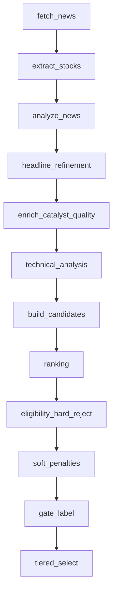
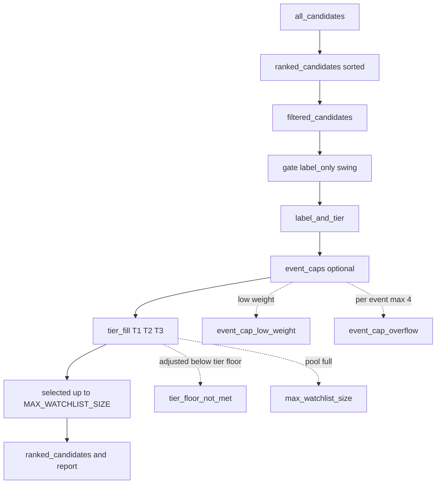

# Pre-Market Pipeline Diagnostics

Operational guide for `premarket_hybrid_v2`: classification quality, tiered filtering, adaptive watchlist expansion, liquidity checks, and ranking (unchanged V2 weights).

See also: [ranking_decision_tree.md](ranking_decision_tree.md), [system_architecture.md](system_architecture.md), [debugging_guide.md](debugging_guide.md), [data_models.md](data_models.md).

## End-to-end flow

## Watchlist selection — where candidates are lost

`final_watchlist_size` equals **all tier-selected survivors across LONG, SHORT, and NEUTRAL** (same set as `ranked_candidates`), not LONG-only.

### Select-stage drop reasons

| Reason | When |
|--------|------|
| `event_cap_low_weight` | `beneficiary_weight < min_event_beneficiary_weight` (default 0.35) |
| `event_cap_overflow` | More than `max_symbols_per_event` (default 4) beneficiaries per event |
| `tier_floor_not_met` | `adjusted_score` below tier-3 floor (swing default 45) and not backfilled |
| `max_watchlist_size` | Meets tier floor but not selected because watchlist already at `MAX_WATCHLIST_SIZE` |

Per-symbol log: `watchlist_select_dropped` with `symbol`, `adjusted_score`, `final_score`, `tier`, `direction`, `reason`.

### Tier selection floors (swing default)

| Pass | Floor on `adjusted_score` |
|------|---------------------------|
| T1 | 75 (also requires `trade_tag=TRADE`) |
| T2 | 60 or `trade_tag=WATCH` |
| T3 | 45 |
| Backfill | Below floors if `selected < MIN_WATCHLIST_SIZE` |

Direction buckets (`LONG` / `SHORT` / `NEUTRAL`) are assigned from sentiment after tier fill; all selected symbols appear in the final report.

## Session-aware news freshness

Premarket ingestion uses **previous NSE close → run time** (not rolling 12h/24h UTC).

| Setting | Default | Role |
|---------|---------|------|
| `USE_SESSION_FRESHNESS` | true | Session window filter + band scoring |
| `NSE_HOLIDAYS_PATH` | `config/nse_holidays.yaml` | Trading holidays (extend annually) |
| `SESSION_FETCH_BUFFER_MINUTES` | 60 | Provider fetch buffer before window start |
| `MARKET_TIMEZONE` | Asia/Kolkata | NSE session timezone |

**Window:** Tue–Fri premarket → previous trading day 15:30 IST; Mon premarket → previous Friday close (holiday-aware).

**Timestamps:** `published_at` vs `first_seen_at` — syndicated/republished stories use `first_seen_at` when publish date is stale.

**Bands:** `AFTER_MARKET` (100) → `OVERNIGHT` (92) → `PREMARKET` (88) → `INTRADAY` (55). Prior-session intraday hard-rejected (`prior_session_stale`).

## Catalyst taxonomy and tiers

| Tier | Policy | Examples |
|------|--------|----------|
| **TIER_1** | Never auto-reject on type alone; Tier-1 technical override for strong direct news | ACQUISITION, ORDER_WIN, DEFENCE_PROCUREMENT, CLINICAL_TRIAL, REGULATORY_MILESTONE, JV_ANNOUNCEMENT, EARNINGS_BEAT |
| **TIER_2** | Weak-type reject only if `catalyst_score < 25`; needs `technical >= 55` **or** `news_score >= 55` | SECTOR_TAILWIND, BROKER_UPGRADE, CAPEX_EXPANSION, EXPORT_OPPORTUNITY |
| **TIER_3** | Aggressive reject (meetings, compliance, generic lists) | BOARD_MEETING, TRADE_SPOTLIGHT, OTHER (when score low) |

`OTHER` is **not** in blanket `WEAK_CATALYST_TYPES`; Tier-3 policy applies.

### Headline refinement

`CatalystHeadlineRefinementService` runs after LLM classification and before article keyword fallback. It reclassifies `OTHER` / `GENERAL_UPDATE` using headline keywords (defence/drone, Phase 3/clinical, sector momentum).

Log: `catalyst_classified symbol=... original_type=OTHER refined_type=DEFENCE_PROCUREMENT confidence=0.9`

Run summary: `classification_summary` with `other_count` (target **< 5** on ~21-stock runs).

## Filter pass 1 vs pass 2

| | Pass 1 (STRICT) | Pass 2 (RELAXED) |
|---|-----------------|------------------|
| Trigger | Always | Only if `accepted < MIN_WATCHLIST_SIZE` and `ADAPTIVE_WATCHLIST_ENABLED=true` |
| Pool | All built candidates | Pass-1 **rejects only** (accepted not re-filtered) |
| Technical | `MIN_TECHNICAL_SCORE_FILTER` (default 50) | −`RELAXED_TECHNICAL_DELTA` (10) |
| Catalyst | `MIN_CATALYST_SCORE` | −`RELAXED_CATALYST_DELTA` (5) |
| Tier-2 broker | `reject_weak_catalyst_types=true` | `allow_tier2_broker_in_relaxed=true` |
| Tag | `selection_mode=STRICT` | `selection_mode=RELAXED` |

Log: `watchlist_expansion_triggered`, `watchlist_expansion_complete`

## Tier-1 technical override

When **direct company news**, **Tier-1** catalyst, and `catalyst_score >= 80`:

- Effective minimum technical = **35** (not 50)
- Log: `catalyst_technical_override symbol=JKLAKSHMI catalyst_type=ACQUISITION catalyst_score=90 technical_score=42 threshold=35`

Env: `TIER1_TECHNICAL_OVERRIDE_MIN_CATALYST`, `TIER1_TECHNICAL_OVERRIDE_MIN_TECHNICAL`

## Liquidity diagnostics

Computed in `TechnicalAnalysisService` from last 20 OHLC sessions:

- `avg_volume_20d` = mean(volume)
- `avg_turnover_20d_inr` = mean(volume × close)

Quality filter (when `USE_TURNOVER_PRIMARY=true`):

- Reject if `avg_turnover_20d_inr < MIN_TURNOVER_20D_INR` (default ₹10 Cr = `1e8`)
- `relative_volume` is secondary (fallback when turnover unavailable)

Log: `liquidity_check symbol=IDEAFORGE avg_volume_20d=... avg_turnover_20d_inr=... required_turnover_inr=... passed=false`

## Rejection explainability

`candidate_rejected` includes: `reason`, `tier`, `catalyst_score`, `effective_catalyst_score`, `technical_score`, `tradability_score`, `materiality_score`, `selection_mode`, `article_title`, `stage` (`catalyst` | `quality`).

## Ranking V2 (unchanged)

Weights: catalyst 0.30, magnitude 0.20, materiality 0.15, tradability 0.10, technical 0.15, sentiment 0.05, confidence 0.05.

## Example cases

| Symbol | Issue | Resolution |
|--------|-------|------------|
| ZENTEC | LLM → OTHER on defence headline | Refinement → DEFENCE_PROCUREMENT; Tier-1 not weak-rejected |
| SUVEN | Opaque `low_liquidity` | `liquidity_check` with turnover vs ₹10 Cr threshold |
| JKLAKSHMI | ACQUISITION @90, technical 42 | Tier-1 override @35 |
| GREENPLY | Tier-2 sector | Needs technical or sentiment ≥ 55 unless relaxed pass |
| IDEAFORGE | Low relative volume | Turnover primary; tune `MIN_TURNOVER_20D_INR` |

## Tuning parameters

| Parameter | Default | Effect |
|-----------|---------|--------|
| `MIN_WATCHLIST_SIZE` | 5 | Triggers relaxed pass |
| `ADAPTIVE_WATCHLIST_ENABLED` | true | Second pass on/off |
| `RELAXED_TECHNICAL_DELTA` | 10 | Relaxed technical floor |
| `RELAXED_CATALYST_DELTA` | 5 | Relaxed catalyst floor |
| `MIN_TURNOVER_20D_INR` | 1e8 | Primary liquidity gate |
| `MIN_TECHNICAL_SCORE_FILTER` | 50 | Strict technical (override 35 for Tier-1) |
| `TIER1_TECHNICAL_OVERRIDE_MIN_CATALYST` | 80 | Override eligibility |
| `tier2_min_catalyst_score` | 25 | Tier-2 weak-type floor |
