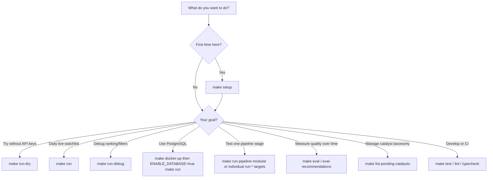

# Morning Trading Agent — Usage Guide

This guide explains **what the project does**, **which command to run in each situation**, and **how to run it correctly**.

For a flat command list, see [MAKEFILE_REFERENCE.md](./MAKEFILE_REFERENCE.md). For architecture and internals, see [system_architecture.md](./system_architecture.md) and [MODULAR_WORKFLOW_ARCHITECTURE.md](./MODULAR_WORKFLOW_ARCHITECTURE.md).

---

## What this project does

The Morning Trading Agent is a **pre-market watchlist generator** for NSE day traders. It:

1. Fetches and filters Indian market news
2. Extracts stocks and classifies catalysts (earnings, orders, compliance noise, etc.)
3. Runs technical analysis on candidates
4. Ranks and filters stocks into a daily watchlist
5. Optionally persists results to PostgreSQL and sends a report to Telegram

It is a **research assistant**, not an auto-trading system. LLMs extract and summarize; ranking and filtering are deterministic Python code.

**Always run commands from the project root:**

```bash
cd morning-trading-agent
```

**Always use the project virtualenv** (not system Python):

```bash
make run-dry          # preferred
# or
.venv/bin/python app.py run-morning-job --dry-run
```

---

## Choose your path (decision flow)



---

## Scenario reference

| Scenario | Command | When to use | Requirements |
|----------|---------|-------------|--------------|
| First-time setup | `make setup` | New machine or fresh clone | Python 3.12+, `uv` |
| Safe smoke test | `make run-dry` | Validate install without APIs | None |
| Daily live watchlist | `make run` | Production pre-market run | `GEMINI_API_KEY` in `.env` |
| Debug filters/ranking | `make run-debug` | See rejected candidates and funnel metrics | None (dry-run) |
| Resume interrupted run | `make run-resume` | Checkpointing enabled, job was interrupted | `ENABLE_CHECKPOINTING=true`, DB, checkpoint extra |
| Start database | `make docker-up` | Need Postgres + migrations | Docker Compose |
| Apply migrations only | `make migrate` | Postgres already running on host | Postgres on `localhost:5432` |
| Persist watchlist to DB | `ENABLE_DATABASE=true make run` | Store recommendations for EOD eval | `make docker-up` first |
| Send Telegram report | `ENABLE_TELEGRAM=true make run` | Push markdown report to chat | Bot token + chat ID in `.env` |
| Run full modular chain | `make run-pipeline-modular` | Test each workflow stage with artifacts | `ENABLE_WORKFLOW_CLI=true` (default) |
| Run single workflow stage | `make run-news`, `run-research`, etc. | Isolate one stage for debugging | Prior stage artifacts for chained steps |
| Test beneficiary agent | `make run-beneficiary-agent` | Indirect sector beneficiary discovery | None (dry-run) |
| Test catalyst verifier | `make run-catalyst-verifier` | Extra catalyst refinement pass | None (dry-run) |
| Test market context V4 | `make run-market-context` | V4 ranking with market context | None (dry-run) |
| Run evaluation suite | `make eval` | Offline quality checks on datasets | None |
| EOD recommendation scoring | `make eval-recommendations DATE=YYYY-MM-DD` | Score prior day's picks vs market | `ENABLE_DATABASE=true`, prior live run |
| View evaluation report | `make show-evaluation DATE=YYYY-MM-DD` | Read stored analytics for a date | Same as above |
| Backtest date range | `make backtest-dry` | Safe backtest without live LLM | None |
| Backtest with live LLM | `make backtest` | Historical replay with real Gemini | `GEMINI_API_KEY` |
| List pending catalysts | `make list-pending-catalysts` | Review LLM-discovered catalyst proposals | `ENABLE_DATABASE=true` |
| Approve catalyst | `make approve-catalyst ID=<uuid>` | Promote pending catalyst to taxonomy | DB + pending row |
| Reject catalyst | `make reject-catalyst ID=<uuid>` | Discard pending catalyst proposal | DB + pending row |
| Run unit tests | `make test` | CI or before committing | `make setup` |
| Lint / format / types | `make lint`, `make format`, `make typecheck` | Code quality checks | Dev dependencies |

---

## 1. First-time setup

### Scenario: I just cloned the repo

```bash
cd morning-trading-agent
cp .env.example .env
# Edit .env and add GEMINI_API_KEY when ready for live runs

make setup
make run-dry
```

`make setup` creates `.venv`, installs the package in editable mode with dev dependencies, and prepares Alembic.

### Scenario: I only want to verify the code works

```bash
make test
make run-dry
```

No Docker, Gemini key, or Postgres required.

---

## 2. Daily watchlist (production)

### Scenario: Generate today's pre-market watchlist (console output)

```bash
# Ensure GEMINI_API_KEY is set in .env
make run
```

Equivalent CLI:

```bash
.venv/bin/python app.py run-morning-job
```

**What happens:** Full LangGraph pipeline — news → research → technical → ranking → watchlist → report. Output is printed to the terminal unless Telegram is enabled.

### Scenario: Run for a specific date

```bash
.venv/bin/python app.py run-morning-job --date 2026-06-05
```

### Scenario: Save results to PostgreSQL

```bash
make docker-up
# Set ENABLE_DATABASE=true in .env
make run
```

`make docker-up` starts Postgres and runs Alembic migrations. It does **not** run the watchlist job.

### Scenario: Send report to Telegram

```bash
# Set in .env:
# ENABLE_TELEGRAM=true
# TELEGRAM_BOT_TOKEN=...
# TELEGRAM_CHAT_ID=...
make run
```

Telegram is off by default; the watchlist still appears in the console.

### Scenario: Cron job before market open (example)

Run from the project directory with venv and `.env` loaded:

```cron
30 2 * * 1-5 cd /path/to/morning-trading-agent && .venv/bin/python app.py run-morning-job >> /var/log/mta.log 2>&1
```

(02:30 UTC ≈ 08:00 IST on weekdays; adjust for your timezone.)

---

## 3. Safe local / offline runs

### Scenario: No API keys, no Docker, no database

```bash
make run-dry
```

Uses stub LLM and market data. Does not persist to DB or Telegram unless you explicitly enable those flags.

### Scenario: Understand why stocks were rejected (compliance noise, low quality, etc.)

```bash
make run-debug
```

Same as dry-run but appends a **ranking pipeline debug report** including:

- Funnel metrics (articles → stocks → tradable catalysts → watchlist)
- Rejected candidates with tradability and quality scores
- Rejection reason breakdown

Use this when procedural filings (postal ballot, EGM proceedings, compliance updates) appear in news but should not reach the watchlist.

### Scenario: Resume after a checkpointed failure

```bash
# Requires ENABLE_CHECKPOINTING=true, pip install -e ".[checkpoint]", and Postgres
make run-resume
# or with explicit thread:
make run-resume THREAD_ID=2026-06-05_morning
```

---

## 4. Database and Docker

### Scenario: Start Postgres and apply migrations

```bash
make docker-up
```

This:

1. Starts the Postgres container (`localhost:5432`)
2. Rebuilds the migrate image (includes latest Alembic scripts)
3. Runs `alembic upgrade head`

**Important:** `make docker-up` prepares the database only. Run `make run` separately to generate a watchlist.

### Scenario: Postgres is already running; apply migrations only

```bash
make migrate
```

Uses `localhost:5432` from `alembic.ini` unless `DATABASE_URL` is exported.

### Scenario: Stop containers

```bash
make docker-down
```

---

## 5. Modular workflows (debug one stage at a time)

Modular commands run in **dry-run** mode and write JSON artifacts under `.artifacts/`. Use them when you need to inspect intermediate state without running the full pipeline.

### Execution order

```text
run-news → run-research → run-technical → run-ranking → run-watchlist → run-reporting
```

Or run all at once:

```bash
make run-pipeline-modular
```

### Individual stages

| Step | Command | Needs prior output? |
|------|---------|---------------------|
| 1. News ingestion | `make run-news` | No |
| 2. Stock extraction + catalyst analysis | `make run-research` | Yes — `.artifacts/news/` |
| 3. Technical analysis | `make run-technical` | Yes — `.artifacts/research/` |
| 4. Build + rank candidates | `make run-ranking` | Yes — `.artifacts/technical/` |
| 5. Filter + select watchlist | `make run-watchlist` | Yes — `.artifacts/ranking/` |
| 6. Report + optional persist | `make run-reporting` | Yes — `.artifacts/watchlist/` |

**Example — debug only the watchlist filter stage:**

```bash
make run-pipeline-modular   # generate full artifact chain once
# edit code, then:
make run-watchlist          # re-run only filter/gate/select
```

Artifacts accumulate under `.artifacts/<stage>/`. See [MAKEFILE_REFERENCE.md](./MAKEFILE_REFERENCE.md) for the JSON file list.

Requires `ENABLE_WORKFLOW_CLI=true` (default in `.env.example`).

---

## 6. Optional agent features (dry-run)

These run the **full** pipeline with a feature flag enabled. Default production behavior is unchanged.

| Scenario | Command | Flag set |
|----------|---------|----------|
| Indirect beneficiary discovery | `make run-beneficiary-agent` | `ENABLE_BENEFICIARY_AGENT=true` |
| Extra catalyst verification | `make run-catalyst-verifier` | `ENABLE_CATALYST_VERIFIER=true` |
| Market context + V4 ranking | `make run-market-context` | `ENABLE_MARKET_CONTEXT=true`, V4 strategy |

---

## 7. Evaluation and backtesting

### Scenario: Run offline evaluation modules (no DB)

```bash
make eval                  # all modules
make eval-beneficiary      # beneficiary discovery only
make eval-ranking          # ranking quality only
```

Datasets live in `evaluation/datasets/`.

### Scenario: Score yesterday's recommendations against market returns

```bash
make docker-up
# ENABLE_DATABASE=true in .env
make run                              # live run that persists recommendations
make eval-recommendations DATE=2026-06-05
make show-evaluation DATE=2026-06-05
```

`eval-recommendations` computes EOD performance; `show-evaluation` prints the analytics report for that trade date.

### Scenario: Backtest a date range

```bash
# Safe — no live LLM
make backtest-dry BACKTEST_FROM=2026-06-01 BACKTEST_TO=2026-06-05

# Live LLM + market data
make backtest BACKTEST_FROM=2026-06-01 BACKTEST_TO=2026-06-05
```

Override dates with `BACKTEST_FROM` and `BACKTEST_TO` Makefile variables.

---

## 8. Catalyst taxonomy admin (database)

When `ENABLE_DB_CATALYST_TAXONOMY=true` and the database is enabled, the LLM can propose new catalyst types that land in a pending queue.

### Scenario: Review pending catalyst proposals

```bash
make docker-up
# ENABLE_DATABASE=true in .env
make list-pending-catalysts
```

### Scenario: Approve a pending catalyst

```bash
make approve-catalyst ID=<pending-uuid>
```

Promotes the proposal into the active taxonomy (used for DB-backed scoring when the feature flag is on).

### Scenario: Reject a pending catalyst

```bash
make reject-catalyst ID=<pending-uuid>
```

CLI equivalents:

```bash
.venv/bin/python app.py list-pending-catalysts
.venv/bin/python app.py approve-catalyst <pending-uuid>
.venv/bin/python app.py reject-catalyst <pending-uuid>
```

---

## 9. Development and CI

| Scenario | Command |
|----------|---------|
| Run all tests | `make test` |
| Tests with coverage | `make test-cov` |
| Lint | `make lint` |
| Auto-format | `make format` |
| Type check | `make typecheck` |
| Show all Make targets | `make help` |

Typical pre-commit check:

```bash
make lint && make typecheck && make test
```

---

## 10. Environment variables by scenario

Copy `.env.example` to `.env` and adjust.

| Variable | Scenario |
|----------|----------|
| `GEMINI_API_KEY` | Required for `make run`, `make backtest` (live) |
| `ENABLE_DATABASE` | Set `true` for persistence, eval-recommendations, catalyst admin |
| `ENABLE_TELEGRAM` | Set `true` to send report to Telegram |
| `ENABLE_DB_CATALYST_TAXONOMY` | Set `true` to use DB catalyst taxonomy (default `false`) |
| `ENABLE_CHECKPOINTING` | Set `true` for `make run-resume` |
| `ENABLE_WORKFLOW_CLI` | Must be `true` for modular `make run-*` workflow targets |
| `DRY_RUN` | Overridden by `--dry-run` on CLI; use `make run-dry` instead |
| `NON_TRADABLE_CATALYST_MODE` | `reject` (default) or `penalize` for compliance-style catalysts |
| `MARKET_DATA_SOURCE` | `bhavcopy` (default), `yfinance`, or `hybrid` |
| `PREMARKET_STRATEGY` | Ranking strategy for pre-market session |

See `.env.example` for the full list and defaults.

---

## 11. Common mistakes

| Mistake | What to do instead |
|---------|-------------------|
| Running `python app.py` with system Python | Use `make run-dry` or `.venv/bin/python app.py` |
| Expecting watchlist from `make docker-up` | Run `make run` after database is up |
| Running `make run-research` before `make run-news` | Run stages in order or use `make run-pipeline-modular` |
| `eval-recommendations` fails | Enable DB, run `make docker-up`, run live job with `ENABLE_DATABASE=true` first |
| Gemini configuration error on first try | Use `make run-dry` until `.env` has a valid key |
| `docker compose` not found | Install Docker Desktop or use `make run-dry` without Docker |
| Catalyst admin commands fail | Set `ENABLE_DATABASE=true` and ensure Postgres is running |

---

## 12. Where to go next

| Topic | Document |
|-------|----------|
| Full Make command list | [MAKEFILE_REFERENCE.md](./MAKEFILE_REFERENCE.md) |
| Pipeline diagnostics and logs | [debugging_guide.md](./debugging_guide.md) |
| Pre-market filter behavior | [PREMARKET_PIPELINE_DIAGNOSTICS.md](./PREMARKET_PIPELINE_DIAGNOSTICS.md) |
| Ranking and rejection rules | [ranking_decision_tree.md](./ranking_decision_tree.md) |
| Modular workflow design | [MODULAR_WORKFLOW_ARCHITECTURE.md](./MODULAR_WORKFLOW_ARCHITECTURE.md) |
| Data models and state | [data_models.md](./data_models.md) |
| Project overview | [../README.md](../README.md) |

---

## Quick command cheat sheet

```bash
# Onboarding
make setup && make run-dry

# Daily production
make run

# Debug
make run-debug

# Database
make docker-up
ENABLE_DATABASE=true make run

# Modular (artifacts in .artifacts/)
make run-pipeline-modular

# Evaluation
make eval
make eval-recommendations DATE=2026-06-05

# Catalyst admin
make list-pending-catalysts
make approve-catalyst ID=<uuid>

# Quality
make test
```
