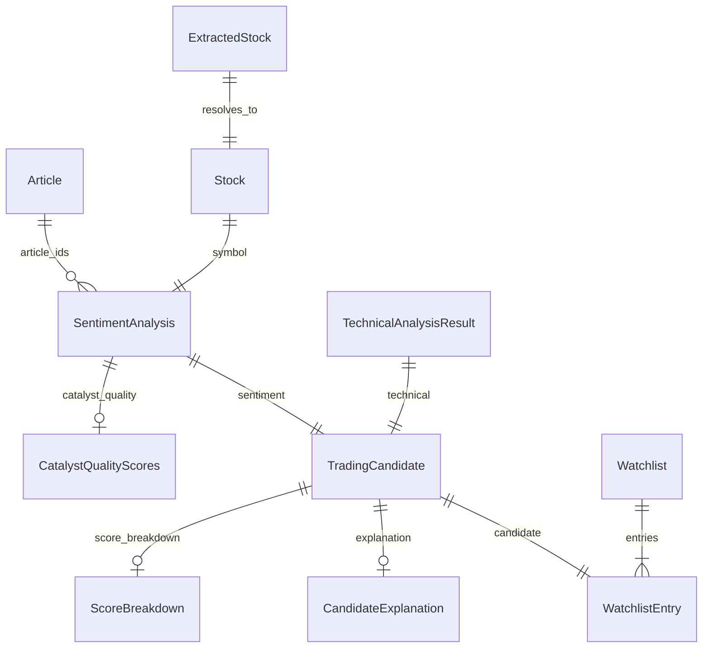

# Morning Trading Agent — Data Models

Reference for domain entities used in the ranking and decision pipeline. JSON examples use illustrative values.

**See also:** [ranking_decision_tree.md](ranking_decision_tree.md) · [system_architecture.md](system_architecture.md) · [debugging_guide.md](debugging_guide.md) · [architecture.md](architecture.md)

---

## Naming Map

Documentation and code use slightly different names for the same concepts:

| Concept (docs) | Code type(s) | Module |
|----------------|--------------|--------|
| Article | `Article` | `domain/entities/article.py` |
| StockMention | `ExtractedStock` → `Stock` + `SentimentAnalysis` | `domain/entities/article.py` |
| Catalyst | `CatalystAnalysis`, `CatalystType`, `CatalystQualityScores` | `domain/entities/catalyst.py`, `domain/value_objects/*` |
| Candidate | `TradingCandidate` | `domain/entities/article.py` |
| RankingScore | `ScoreBreakdown` + `TradingCandidate.final_score` | `domain/entities/explanation.py` |
| WatchlistEntry | `WatchlistEntry`, `Watchlist` | `domain/entities/article.py` |

---

## Article

Raw or enriched news item from ingestion.

| Field | Type | Constraints | Purpose |
|-------|------|-------------|---------|
| `id` | UUID | auto | Primary key |
| `title` | str | required | Headline |
| `content` | str | required | Body text for classification/extraction |
| `source` | str | required | Provider id (e.g. economic_times) |
| `published_at` | datetime | required | Publication time (UTC) |
| `url` | str | default "" | Canonical link for dedup |
| `fetched_at` | datetime | auto | Ingestion timestamp |
| `first_seen_at` | datetime \| null | optional | First discovery in pipeline (syndicated/republished) |
| `freshness_reference_time` | datetime \| null | optional | Effective time used for session filter/score |
| `freshness_band` | str \| null | optional | `AFTER_MARKET`, `OVERNIGHT`, `PREMARKET`, `INTRADAY` |
| `run_date` | datetime \| null | optional | Run association |
| `age_minutes` | int | ≥ 0 | Age at ingest |
| `freshness_score` | float | 0–100 | Tiered freshness |
| `catalyst_score` | float | 0–100 | Keyword catalyst score |
| `article_category` | str | default general | Legacy category string |
| `catalyst_type` | CatalystType | enum | Article-level catalyst |
| `catalyst_analysis` | CatalystAnalysis \| null | optional | Structured analysis |
| `priority_score` | float | 0–100 | Ingestion priority |

**Example JSON:**

```json
{
  "id": "a1b2c3d4-e5f6-7890-abcd-ef1234567890",
  "title": "India considering Rs 20,000 crore drone procurement",
  "content": "Government evaluates large-scale drone procurement for defence sector...",
  "source": "economic_times",
  "published_at": "2026-06-03T06:30:00Z",
  "url": "https://example.com/drone-procurement",
  "age_minutes": 45,
  "freshness_score": 90.0,
  "catalyst_score": 60.0,
  "catalyst_type": "SECTOR_TAILWIND",
  "priority_score": 72.0
}
```

---

## StockMention (ExtractedStock + SentimentAnalysis)

A stock mention progresses from LLM extraction to per-symbol sentiment.

### ExtractedStock

LLM output before symbol resolution.

| Field | Type | Constraints | Purpose |
|-------|------|-------------|---------|
| `symbol` | str | required | NSE/BSE ticker |
| `company_name` | str | required | Company name from text |
| `confidence` | float | 0–1 | Extraction confidence |

**Example JSON:**

```json
{
  "symbol": "ZENTEC",
  "company_name": "Zen Technologies Ltd",
  "confidence": 0.88
}
```

### Stock

Resolved listed entity.

| Field | Type | Purpose |
|-------|------|---------|
| `symbol` | str | Ticker |
| `company_name` | str | Official name |
| `exchange` | str | Default NSE |

### SentimentAnalysis

Per-symbol news analysis (post-LLM and classification).

| Field | Type | Constraints | Purpose |
|-------|------|-------------|---------|
| `symbol` | str | required | Ticker |
| `score` | float | -10 to 10 | News impact direction/strength |
| `confidence` | float | 0–1 | LLM confidence |
| `direction` | SentimentDirection | enum | bullish / bearish / neutral |
| `reason` | str | required | One-sentence evidence |
| `article_ids` | list[UUID] | optional | Linked articles |
| `freshness_score` | float | 0–100 | Aggregated from articles |
| `catalyst_score` | float | 0–100 | Type score with direct-news cap |
| `priority_score` | float | 0–100 | Aggregated priority |
| `primary_catalyst_type` | CatalystType | enum | Dominant catalyst |
| `primary_catalyst_summary` | str | optional | Short summary |
| `direct_company_news` | bool | default true | Company-specific vs thematic |
| `thematic_sector_catalyst` | bool | default false | Govt/defence escalation flag |
| `llm_classified` | bool | default false | LLM provided catalyst type |
| `catalyst_quality` | CatalystQualityScores \| null | post-enrich | Magnitude/materiality/tradability |
| `llm_catalyst_magnitude` | CatalystMagnitude \| null | optional | LLM hint |
| `llm_estimated_value_crore` | float \| null | optional | Deal size hint |
| `llm_strategic_importance` | str \| null | optional | transformational / significant / routine |

**Example JSON (ZENTEC after escalation):**

```json
{
  "symbol": "ZENTEC",
  "score": 6.5,
  "confidence": 0.82,
  "direction": "bullish",
  "reason": "Large government drone procurement program benefits defence sector suppliers",
  "primary_catalyst_type": "DEFENCE_PROCUREMENT",
  "primary_catalyst_summary": "Defence Procurement: India considering Rs 20,000 crore drone program",
  "direct_company_news": false,
  "thematic_sector_catalyst": true,
  "catalyst_score": 95.0,
  "freshness_score": 88.0,
  "catalyst_quality": {
    "magnitude": "VERY_HIGH",
    "magnitude_score": 100.0,
    "materiality_score": 95.0,
    "tradability_score": 90.0,
    "effective_catalyst_score": 92.0,
    "financial_value_crore": 20000.0,
    "magnitude_source": "llm_value"
  }
}
```

---

## Catalyst

### CatalystType (enum)

Full list in `domain/value_objects/catalyst.py`.

**Strong / tradable (examples):** ORDER_WIN, LARGE_CONTRACT, EARNINGS_BEAT, BUYBACK, ACQUISITION, REGULATORY_APPROVAL, DEFENCE_PROCUREMENT, GOVERNMENT_SPENDING, STRATEGIC_PROCUREMENT, THEMATIC_DEMAND_SURGE, INDUSTRY_POLICY_CHANGE, PARTNERSHIP, CAPEX_EXPANSION, CORPORATE_ACTION, …

**Weak (filtered when `reject_weak_catalyst_types`):** BROKER_RATING, GENERAL_UPDATE, OTHER, TRADE_SPOTLIGHT, STOCKS_TO_WATCH, GENERIC_MENTION, …

**Non-tradable (default reject):** EXCHANGE_CLARIFICATION, INVESTOR_MEETING, ANALYST_MEETING, PLANT_VISIT, COMPLIANCE_FILING, GENERAL_UPDATE, … — see `DEFAULT_NON_TRADABLE_TYPES`.

### CatalystAnalysis

Article-level structured catalyst (from keyword engine).

| Field | Type | Purpose |
|-------|------|---------|
| `catalyst_type` | CatalystType | Classified type |
| `catalyst_score` | float | 0–100 configured score |
| `summary` | str | Short human summary |
| `matched_keywords` | list[str] | Keywords that fired |

**Example JSON:**

```json
{
  "catalyst_type": "DEFENCE_PROCUREMENT",
  "catalyst_score": 95.0,
  "summary": "Defence Procurement: India considering drone procurement",
  "matched_keywords": ["drone procurement", "defence"]
}
```

### CatalystQualityScores

Per-symbol enriched dimensions (ranking V2).

| Field | Type | Purpose |
|-------|------|---------|
| `magnitude` | CatalystMagnitude | VERY_HIGH … VERY_LOW |
| `magnitude_score` | float | 0–100 |
| `materiality_score` | float | 0–100 |
| `tradability_score` | float | 0–100 |
| `effective_catalyst_score` | float | 0–100 after broker cap |
| `financial_value_crore` | float \| null | Parsed/LLM deal size |
| `magnitude_source` | str | baseline / parser / llm |

### CatalystMagnitude (enum)

`VERY_HIGH`, `HIGH`, `MEDIUM`, `LOW`, `VERY_LOW`

---

## Candidate (TradingCandidate)

Merged news + technical signal ready for filter/rank.

| Field | Type | Purpose |
|-------|------|---------|
| `stock` | Stock | Identity |
| `news_score` | float | 0–100 from sentiment |
| `technical_score` | float | 0–100 |
| `confidence_score` | float | 0–100 |
| `freshness_score` | float | 0–100 |
| `catalyst_score` | float | Raw catalyst score |
| `effective_catalyst_score` | float \| null | Post-quality effective |
| `magnitude_score` | float \| null | Denormalized from quality |
| `materiality_score` | float \| null | Denormalized |
| `tradability_score` | float \| null | Denormalized |
| `priority_score` | float | 0–100 |
| `final_score` | float | 0–100 V2 composite |
| `score_breakdown` | ScoreBreakdown \| null | Weighted audit |
| `explanation` | CandidateExplanation \| null | Post-explain node |
| `sentiment` | SentimentAnalysis | Full news side |
| `technical` | TechnicalAnalysis | Legacy technical snapshot |

**Example JSON (accepted ZENTEC sketch):**

```json
{
  "stock": { "symbol": "ZENTEC", "company_name": "Zen Technologies Ltd", "exchange": "NSE" },
  "news_score": 82.5,
  "technical_score": 82.0,
  "confidence_score": 82.0,
  "catalyst_score": 95.0,
  "effective_catalyst_score": 92.0,
  "magnitude_score": 100.0,
  "materiality_score": 95.0,
  "tradability_score": 90.0,
  "final_score": 88.2,
  "score_breakdown": {
    "catalyst": 92.0,
    "magnitude": 100.0,
    "materiality": 95.0,
    "tradability": 90.0,
    "technical": 82.0,
    "sentiment": 82.5,
    "confidence": 82.0,
    "final": 88.2,
    "weighted_catalyst": 27.6,
    "weighted_magnitude": 20.0,
    "weighted_materiality": 14.25,
    "weighted_tradability": 9.0,
    "weighted_technical": 12.3,
    "weighted_sentiment": 4.13,
    "weighted_confidence": 4.1
  },
  "sentiment": { "symbol": "ZENTEC", "primary_catalyst_type": "DEFENCE_PROCUREMENT", "thematic_sector_catalyst": true }
}
```

---

## RankingScore (ScoreBreakdown)

Weighted decomposition of `final_score`. All raw dimension fields are 0–100.

| Field | Purpose |
|-------|---------|
| `technical`, `catalyst`, `sentiment`, `confidence` | Raw inputs |
| `magnitude`, `materiality`, `tradability` | V2 quality dimensions |
| `freshness`, `priority` | Legacy V1 fields (optional) |
| `market_context_bonus` | V4 sector/market-context bonus (0–5); persisted for audit |
| `final` | Composite score |
| `weighted_catalyst`, `weighted_magnitude`, … | Weight × raw for audit |

**Note:** `sector_bonus` lives on `TechnicalScoreBreakdown` (technical analysis), not on ranking `ScoreBreakdown`. Pipeline ranking audit emits `technical_sector_bonus` and `market_context_bonus` separately.

---

## WatchlistEntry

| Field | Type | Purpose |
|-------|------|---------|
| `rank` | int | ≥ 1 position in watchlist |
| `candidate` | TradingCandidate | Full candidate |
| `risk_level` | str | Low / Medium / High |
| `key_catalyst` | str | Display string |
| `notes` | str | Optional notes |
| `explanation` | CandidateExplanation \| null | Optional copy |

### Watchlist

| Field | Type | Purpose |
|-------|------|---------|
| `id` | UUID | Watchlist id |
| `run_date` | datetime | Trading date |
| `strategy` | str | e.g. premarket_hybrid_v2 |
| `entries` | list[WatchlistEntry] | Ranked rows |
| `created_at` | datetime | Created timestamp |

**Example JSON:**

```json
{
  "run_date": "2026-06-03T00:00:00Z",
  "strategy": "premarket_hybrid_v2",
  "entries": [
    {
      "rank": 1,
      "candidate": { "stock": { "symbol": "ZENTEC" }, "final_score": 88.2 },
      "risk_level": "Medium",
      "key_catalyst": "DEFENCE_PROCUREMENT — Rs 20,000 Cr drone program exposure"
    }
  ]
}
```

---

## TechnicalAnalysisResult

Pre-market technical output (used at build time).

| Field | Type | Purpose |
|-------|------|---------|
| `symbol` | str | Ticker |
| `rsi`, `ema20`, `ema50`, `vwap` | float | Indicators |
| `relative_volume`, `atr` | float | Volume/volatility |
| `price_momentum`, `volume_momentum` | float | Momentum |
| `previous_close` | float | For penny filter |
| `highest_high_20`, `breakout_20d` | float/bool | Breakout |
| `technical_score` | float | 0–100 composite |
| `score_breakdown` | TechnicalScoreBreakdown | Component scores (includes `sector_bonus` when sector tailwind applies) |
| `explanation` | TechnicalExplanation \| null | Optional narrative |

---

## Workflow Artifacts

### TradingState

LangGraph state (`graph/state.py`). Key list fields:

- `articles`, `ingestion_stats`, `identified_stocks`, `sentiment_results`, `technical_results`
- `all_candidates`, `filtered_candidates`, `ranked_candidates`, `rejected_candidates`, `near_miss_candidates`
- `pipeline_traces`, `filter_rejection_counts`, `watchlist`, `report`, `errors`
- `llm_analysis_failures`, `llm_analysis_succeeded`, `llm_analysis_failed` — per-stock LLM resilience audit
- Flags: `dry_run`, `debug_ranking`

### CandidatePipelineTrace

Per-symbol audit trail (`domain/entities/pipeline_trace.py`).

| Field | Purpose |
|-------|---------|
| `symbol`, `stage` | Identity and pipeline stage |
| `catalyst_type`, `catalyst_score`, `catalyst_magnitude` | Catalyst path |
| `magnitude_score`, `materiality_score`, `tradability_score` | Quality |
| `technical_score`, `final_score` | Scores |
| `rejected`, `rejection_reason` | Filter outcome |
| `watchlist_rank`, `survival_reason` | Selection outcome |
| `dropped_reason` | Build-time drop |

### NewsIngestionStats

| Field | Purpose |
|-------|---------|
| `articles_fetched` | Raw count |
| `articles_removed_freshness` | Stale drops |
| `articles_removed_low_quality` | Quality gate drops |
| `articles_removed_duplicate` | Dedup drops |
| `articles_analyzed` | Final count |
| `catalysts_identified` | Type histogram |
| `freshness_distribution`, `priority_distribution` | Buckets |
| `provider_counts` | Per-provider fetch |

---

## Entity Relationships



---

## See also

- [ranking_decision_tree.md](ranking_decision_tree.md) — when each model is populated
- [system_architecture.md](system_architecture.md) — services that read/write these models
- [debugging_guide.md](debugging_guide.md) — inspecting models at runtime
