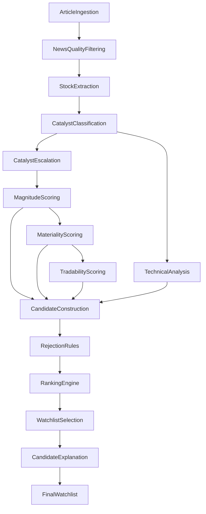

# Morning Trading Agent Ranking Decision Tree

This document describes the complete lifecycle of a stock candidate from raw news ingestion through final watchlist selection. It is the authoritative reference for ranking and rejection behavior.

**See also:** [system_architecture.md](system_architecture.md) · [debugging_guide.md](debugging_guide.md) · [data_models.md](data_models.md) · [architecture.md](architecture.md) · [PREMARKET_PIPELINE_DIAGNOSTICS.md](PREMARKET_PIPELINE_DIAGNOSTICS.md)

---

## High Level Flow

1. Article Ingestion
2. News Quality Filtering
3. Stock Extraction
4. Catalyst Classification
5. Catalyst Escalation
6. Magnitude Scoring
7. Materiality Scoring
8. Tradability Scoring
9. Technical Analysis
10. Candidate Construction
11. Rejection Rules
12. Ranking Engine
13. Watchlist Selection
14. Candidate Explanation
15. Final Watchlist (report generation)



**LangGraph node order** (implementation): `fetch_news` → `extract_stocks` → `analyze_news` → `enrich_catalyst_quality` → `technical_analysis` → `build_candidates` → `filter_watchlist` → `ranking` → `select_watchlist` → `explain_candidates` → `generate_watchlist` → `persist_results` → `send_telegram`

Default ranking strategy: `premarket_hybrid_v2` (`RANKING_STRATEGY` env var).

---

## State Evolution

| Stage complete | `TradingState` fields populated |
|----------------|----------------------------------|
| After fetch | `articles`, `ingestion_stats` |
| After extract | `identified_stocks` |
| After analyze | `sentiment_results` |
| After enrich | `sentiment_results` (with `catalyst_quality`) |
| After technical | `technical_results` |
| After build | `all_candidates`, `pipeline_traces`, `dropped_missing_analysis_count` |
| After filter | `filtered_candidates`, `rejected_candidates`, `near_miss_candidates`, `filter_rejection_counts` |
| After rank | `ranked_candidates` (sorted survivors) |
| After select | `ranked_candidates` (capped to `MAX_WATCHLIST_SIZE`) |
| After explain | `ranked_candidates` (with `explanation`) |
| After generate | `watchlist`, `report` |

---

## Detailed Flow

### 1. Article Ingestion

**Purpose**  
Collect pre-market news from configured providers and attach baseline metadata before any LLM work.

**Inputs**
- `NEWS_PROVIDERS` (comma-separated: moneycontrol, economic_times, google_news, nse_announcements)
- `NEWS_FETCH_LIMIT`, `NEWS_LOOKBACK_HOURS`
- Run timestamp (`now`)

**Processing** (`NewsAggregatorService.collect`)
1. Fetch from each `NewsProvider` adapter in parallel (per-provider limit).
2. `FreshnessScoringService` — set `age_minutes`, `freshness_score`.
3. `CatalystAnalysisService.enrich_article` — keyword classification, `catalyst_type`, `catalyst_score`, `CatalystAnalysis`.
4. News quality gate (next stage).
5. `NewsPriorityService` — `priority_score`.
6. `FreshnessFilter` — drop articles older than `NEWS_FRESHNESS_HOURS`.
7. `NewsDeduplication` — URL/title dedup.
8. Cap to `NEWS_FETCH_LIMIT`.

**Outputs**
- `list[Article]` in state
- `NewsIngestionStats`: fetched, removed (freshness, duplicate, low quality), catalyst histogram

**Failure conditions**
- Provider network errors are logged (`provider_failed`); other providers continue.
- Zero articles after filters → no stocks extracted downstream.

**Implementation:** `application/services/news/news_aggregator_service.py`, `config/factories/provider_factory.py`

---

### 2. News Quality Filtering

**Purpose**  
Drop generic or low-signal articles before LLM stock extraction to reduce `OTHER` / `GENERAL_UPDATE` noise.

**Inputs**
- Enriched `Article` with `catalyst_type`

**Processing** (`NewsQualityScorer`)
- Score from `NewsQualityConfig.quality_by_type` (e.g. ORDER_WIN=100, GENERAL_UPDATE=0).
- Drop if `quality_score < MIN_ARTICLE_QUALITY_SCORE` (default 15).

**Outputs**
- Filtered article list; `articles_removed_low_quality` incremented in stats.

**Failure conditions**
- Article removed here never reaches extraction (symbol never discovered from that article alone).

**Implementation:** `application/services/news/news_quality_scorer.py`

---

### 3. Stock Extraction

**Purpose**  
Identify NSE/BSE-listed companies mentioned in news using LLM structured extraction.

**Inputs**
- `state["articles"]`
- Gemini (live) or `StubLLMProvider` (dry-run)

**Processing** (`ExtractStocksNode`)
1. LLM `extract_stocks` → `list[ExtractedStock]` (symbol, company_name, confidence).
2. `SymbolResolver.resolve_batch` → canonical `Stock` entities.

**Outputs**
- `state["identified_stocks"]`

**Failure conditions**
- Low-confidence extractions may still resolve; empty list stops pipeline for news-only path.
- Unlisted/global names filtered by prompt rules.

**Implementation:** `graph/nodes/workflow_nodes.py` (`ExtractStocksNode`), `infrastructure/llm/*`

---

### 4. Catalyst Classification

**Purpose**  
Per-symbol news sentiment, catalyst type, and whether news is company-specific vs thematic/indirect.

**Inputs**
- `identified_stocks`, `articles`
- LLM `analyze_news` → `LLMSentimentAnalysis` fields

**Processing** (`AnalyzeNewsNode` + `CatalystClassificationService`)
1. LLM returns: `score`, `direction`, `catalyst_type`, `direct_company_news`, `catalyst_magnitude`, `estimated_value_crore`, `strategic_importance`.
2. `SentimentAnalysisMapper` → domain `SentimentAnalysis`.
3. Article keyword fallback when `llm_classified=false` or type is OTHER/GENERIC.
4. `CatalystScoringService.score_with_direct_news_cap` — halve score when `direct_company_news=false` for non-thematic types.
5. `SentimentEnricher` — aggregate `freshness_score`, `priority_score` from linked articles.

**Outputs**
- `state["sentiment_results"]`: `primary_catalyst_type`, `catalyst_score`, `direct_company_news`, LLM magnitude hints

**Failure conditions**
- Misclassification (e.g. sector story as OTHER) affects escalation and filter paths downstream.

**Implementation:** `application/services/catalyst/catalyst_classification_service.py`, `infrastructure/llm/prompts/templates.py`

---

### 5. Catalyst Escalation

**Purpose**  
Upgrade thematic government/defence procurement stories from generic `SECTOR_TAILWIND` / `OTHER` to specific high-impact types.

**Inputs**
- `SentimentAnalysis`, linked `Article` text
- `CatalystEscalationConfig` (keywords, `GOVERNMENT_PROCUREMENT_CRORE_THRESHOLD`)

**Processing** (`CatalystEscalationService.apply`, inside `CatalystQualityEnrichmentService`)
- Match defence/government/sector keywords and crore thresholds.
- Escalate to `DEFENCE_PROCUREMENT`, `GOVERNMENT_SPENDING`, `STRATEGIC_PROCUREMENT`, `THEMATIC_DEMAND_SURGE`, or `INDUSTRY_POLICY_CHANGE`.
- Set `thematic_sector_catalyst=true`.

**Outputs**
- Updated `primary_catalyst_type`, `thematic_sector_catalyst` flag

**Failure conditions**
- No match → type unchanged; may later hit `weak_catalyst_without_direct_news` if indirect and low scores.

**Implementation:** `application/services/catalyst_quality/catalyst_escalation_service.py`

---

### 6. Magnitude Scoring

**Purpose**  
Quantify financial/strategic scale of the catalyst (deal size, program size).

**Inputs**
- Sentiment LLM hints (`llm_catalyst_magnitude`, `llm_estimated_value_crore`)
- Article text for `FinancialAmountParser`
- `CatalystMagnitudeConfig` thresholds

**Processing** (`CatalystMagnitudeService`)
- Parse ₹ crore values from text.
- Map to `CatalystMagnitude` (VERY_HIGH … VERY_LOW) and 0–100 `magnitude_score`.

**Outputs**
- `CatalystQualityScores.magnitude`, `magnitude_score`, `financial_value_crore`, `magnitude_source`

**Failure conditions**
- Missing value → type baseline magnitude; may under-rank large thematic programs without crore in text.

**Implementation:** `application/services/catalyst_quality/catalyst_magnitude_service.py`

---

### 7. Materiality Scoring

**Purpose**  
Score whether the catalyst is materially significant for the stock (not procedural noise).

**Inputs**
- `primary_catalyst_type`, `magnitude_score`, `financial_value_crore`, `strategic_importance`
- High/low materiality type sets

**Processing** (`MaterialityService`)
- Type-based base + magnitude multiplier + value bonuses.
- `thematic_sector_catalyst` → floor boost (min ~70).

**Outputs**
- `CatalystQualityScores.materiality_score` (0–100)

**Failure conditions**
- Low materiality → may fail `MIN_MATERIALITY_SCORE` if configured.

**Implementation:** `application/services/catalyst_quality/materiality_service.py`

---

### 8. Tradability Scoring

**Purpose**  
Answer: would a day trader care about this catalyst tomorrow morning?

**Inputs**
- Catalyst type priors, materiality, magnitude
- `direct_company_news`, `thematic_sector_catalyst`
- `NonTradableCatalystConfig`

**Processing** (`TradabilityService`)
- Blend type prior + materiality + magnitude weights.
- Non-tradable types → cap or reject mode.
- `direct_company_news=false` → cap at 35 **unless** `thematic_sector_catalyst` → floor at `THEMATIC_TRADABILITY_FLOOR` (65).

**Outputs**
- `CatalystQualityScores.tradability_score`
- `EffectiveCatalystScoreService` → `effective_catalyst_score` (broker cap, type score)

**Failure conditions**
- Tradability &lt; `MIN_TRADABILITY_FOR_INDIRECT_NEWS` (60) when indirect → `no_direct_tradable_catalyst`.

**Implementation:** `application/services/catalyst_quality/tradability_service.py`, `effective_catalyst_score_service.py`

---

### 9. Technical Analysis

**Purpose**  
Deterministic pre-market technical score from price/volume indicators (no LLM).

**Inputs**
- `Stock.symbol`, `TECHNICAL_LOOKBACK_DAYS`, market data provider (bhavcopy/yfinance)
- `TechnicalWeightConfig`, `SectorMomentumConfig`

**Processing** (`TechnicalAnalysisService`)
- RSI, EMA20/50, VWAP, relative volume, ATR, momentum, 20d breakout.
- Weighted `TechnicalScoreBreakdown` → `technical_score` (0–100).

**Outputs**
- `state["technical_results"]`: `TechnicalAnalysisResult`

**Failure conditions**
- Missing market data → symbol dropped at `build_candidates` (`dropped_missing_technical`).

**Implementation:** `application/services/technical_analysis_service.py`, `application/services/technical_score.py`

---

### 10. Candidate Construction

**Purpose**  
Merge sentiment + technical into `TradingCandidate` and compute V2 `final_score`.

**Inputs**
- `identified_stocks`, `sentiment_results`, `technical_results`
- `RankingWeightV2Config`

**Processing** (`BuildCandidatesNode`, `PremarketQualityRankingStrategy.build_candidates`)
- Join by symbol; drop missing sentiment or technical.
- V2 formula (see below) → `final_score`, `ScoreBreakdown`.
- `RankingPipelineAuditService` records traces.

**Outputs**
- `state["all_candidates"]`, `pipeline_traces`

**Failure conditions**
- `dropped_missing_analysis_count` when sentiment or technical missing.

**Implementation:** `application/ranking/premarket_quality_strategy.py`

---

### 11. Rejection Rules

**Purpose**  
Remove candidates unsuitable for pre-market watchlist before sorting.

**Inputs**
- `all_candidates`
- `CatalystRejectionConfig`, `NonTradableCatalystConfig`, `WatchlistQualityConfig`

**Processing** (`FilterWatchlistNode`)
1. `CandidateFilterService` — catalyst rules (ordered checks).
2. `WatchlistQualityFilterService` — price, volume, sentiment, duplicate catalyst.
3. `NearMissReviewService` — flag high-scoring rejects in `near_miss_candidates`.

**Outputs**
- `filtered_candidates`, `rejected_candidates`, `near_miss_candidates`, `filter_rejection_counts`

**Failure conditions** — see [Rejection Reason Catalog](#rejection-reason-catalog).

**Implementation:** `application/services/candidate_filter_service.py`, `watchlist_quality_filter.py`, `near_miss_review_service.py`

---

### 12. Ranking Engine

**Purpose**  
Sort survivors by `final_score` descending. **Does not recompute scores.**

**Inputs**
- `filtered_candidates`

**Processing** (`RankingNode`)
- `PremarketQualityRankingStrategy.sort_candidates`
- Log top-5 `ranking_explanation` structlog events

**Outputs**
- `ranked_candidates` (full sorted list)

**Implementation:** `graph/nodes/workflow_nodes.py` (`RankingNode`)

---

### 13. Watchlist Selection

**Purpose**  
Cap output to `MAX_WATCHLIST_SIZE` (default 10).

**Inputs**
- Sorted `ranked_candidates`

**Processing** (`SelectWatchlistNode`)
- Take top N; update pipeline traces with `watchlist_rank`.

**Outputs**
- Truncated `ranked_candidates`

---

### 14. Candidate Explanation

**Purpose**  
Attach human-readable explanations for report and audit.

**Inputs**
- Final `ranked_candidates`

**Processing** (`ExplainCandidatesNode`, `CandidateExplanationBuilder`)

**Outputs**
- `candidate.explanation`, `CandidateExplanation` fields

---

### 15. Final Watchlist

**Purpose**  
Produce markdown report and optional Telegram/DB persistence.

**Inputs**
- `ranked_candidates`, watchlist metadata

**Processing** (`GenerateWatchlistNode`, `WatchlistReportBuilder`, optional Gemini narrative)
- Build `Watchlist` / `WatchlistEntry` with risk level, key catalyst.
- `--debug-ranking` appends `RankingDebugReportBuilder` output to report.

**Outputs**
- `watchlist`, `report` (markdown)

---

## Ranking Formula V2

Default weights (`premarket_hybrid_v2`):

```
final_score =
  0.30 × effective_catalyst_score
+ 0.20 × magnitude_score
+ 0.15 × materiality_score
+ 0.10 × tradability_score
+ 0.15 × technical_score
+ 0.05 × news_score        (sentiment 0–100)
+ 0.05 × confidence_score  (0–100)
```

Configured via `RANKING_V2_WEIGHT_*` environment variables. Weights must sum to 1.0.

`ScoreBreakdown` stores raw dimension scores and weighted contributions (`weighted_catalyst`, etc.).

**Important:** Scores are computed in `build_candidates`. `ranking` node only sorts.

---

## Rejection Reason Catalog

### Catalyst filter (`CandidateFilterService`)

| Reason | When |
|--------|------|
| `exchange_or_compliance_noise` | Type is `EXCHANGE_CLARIFICATION` or `COMPLIANCE_FILING` |
| `non_tradable_catalyst` | Type in `DEFAULT_NON_TRADABLE_TYPES` and `NON_TRADABLE_CATALYST_MODE=reject` |
| `weak_catalyst_type` | Type in `WEAK_CATALYST_TYPES` and `reject_weak_catalyst_types=true` |
| `no_direct_tradable_catalyst` | `direct_company_news=false` and `tradability_score < MIN_TRADABILITY_FOR_INDIRECT_NEWS` (60) |
| `low_tradability_score` | Below `MIN_TRADABILITY_SCORE` if set |
| `low_materiality_score` | Below `MIN_MATERIALITY_SCORE` if set |
| `low_catalyst_score` | `effective_catalyst_score < MIN_CATALYST_SCORE` (20) |
| `weak_catalyst_without_direct_news` | Indirect news and effective &lt; `MIN_CATALYST_SCORE_NO_DIRECT_NEWS` (40), unless thematic bypass applies |
| `weak_technical_score` | `technical_score < MIN_TECHNICAL_SCORE_FILTER` (50) |

**Thematic bypass** for `weak_catalyst_without_direct_news`: when `thematic_sector_catalyst=true` and tradability ≥ `THEMATIC_TRADABILITY_FLOOR` (65) and materiality ≥ `THEMATIC_MATERIALITY_FLOOR` (60), candidate is not rejected for this reason.

### Watchlist quality filter (`WatchlistQualityFilterService`)

| Reason | When |
|--------|------|
| `penny_stock` | `previous_close < MIN_PRICE_INR` |
| `low_liquidity` | `relative_volume < min_relative_volume` (0.5) |
| `low_average_volume` | Volume proxy below `MIN_AVERAGE_VOLUME` |
| `weak_sentiment` | `news_score < MIN_SENTIMENT_SCORE` |
| `weak_technical` | `technical_score < MIN_TECHNICAL_SCORE` (quality bar, distinct from catalyst filter) |
| `duplicate_catalyst` | Same `primary_catalyst_type` already accepted in batch |

### Near miss (`NearMissReviewService`)

Not a rejection reason — rejected candidates with catalyst ≥60, tradability ≥60, materiality ≥60, or final ≥60 are copied to `near_miss_candidates` for manual review.

---

## Worked Examples

*Illustrative walkthrough scores — actual values depend on live news and market data.*

### Accepted candidate: ZENTEC

**Article:** India considering ₹20,000 crore drone procurement program for armed forces.

| Stage | Value |
|-------|-------|
| Article catalyst (keywords) | `SECTOR_TAILWIND` |
| LLM classification | `SECTOR_TAILWIND`, `direct_company_news=false` |
| After escalation | `DEFENCE_PROCUREMENT`, `thematic_sector_catalyst=true` |
| Magnitude | VERY_HIGH (100) — ₹20,000 Cr |
| Materiality | ~95 |
| Tradability | ~90 (thematic floor, not 35 cap) |
| Technical | ~82 |
| Effective catalyst | ~90+ |
| Filter | Passes (thematic bypass on weak indirect rule) |
| Final score | ~88 |
| Watchlist | **YES** |

### Rejected candidate: GREENPLY

**Article:** Analyst plant visit scheduled; no material outcome disclosed.

| Stage | Value |
|-------|-------|
| Classification | `PLANT_VISIT` or `ANALYST_MEETING` |
| Magnitude | VERY_LOW |
| Materiality | ~15 |
| Tradability | ~10 |
| Filter reason | `non_tradable_catalyst` |
| Watchlist | **NO** |

---

## See also

- [system_architecture.md](system_architecture.md) — components, services, patterns, extensions
- [debugging_guide.md](debugging_guide.md) — CLI and log-based troubleshooting
- [data_models.md](data_models.md) — entity fields and JSON examples
- [architecture.md](architecture.md) — clean architecture overview and ADRs
