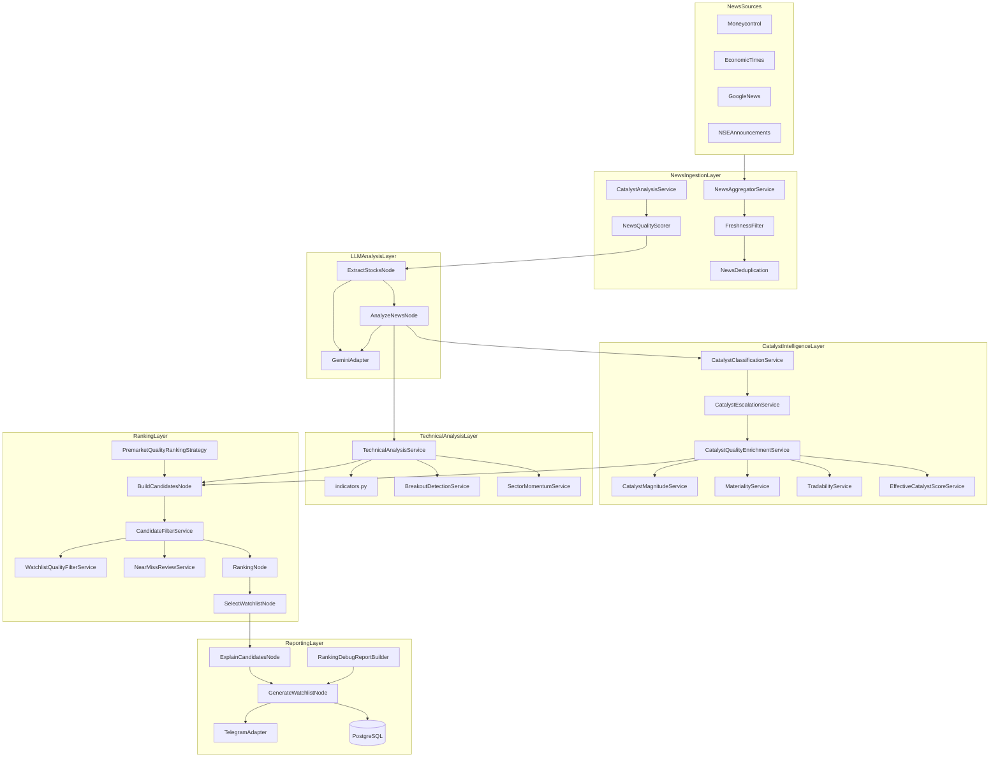

# Morning Trading Agent — System Architecture

Layered architecture for the pre-market watchlist pipeline: news ingestion, catalyst intelligence, technical analysis, ranking, and reporting.

**See also:** [ranking_decision_tree.md](ranking_decision_tree.md) · [debugging_guide.md](debugging_guide.md) · [data_models.md](data_models.md) · [architecture.md](architecture.md)

---

## 1. Component Diagram



### Package mapping

| Layer | Path |
|-------|------|
| News sources | `infrastructure/providers/news/*` |
| News ingestion | `application/services/news/*` |
| LLM analysis | `infrastructure/llm/*`, `graph/nodes/workflow_nodes.py` |
| Catalyst intelligence | `application/services/catalyst/*`, `application/services/catalyst_quality/*` |
| Technical analysis | `application/services/technical_analysis_service.py`, `application/services/technical/*`, `application/services/indicators.py` |
| Ranking | `application/ranking/*`, `application/services/candidate_filter_service.py` |
| Reporting | `application/builders/*`, `graph/nodes/workflow_nodes.py`, `infrastructure/telegram/*` |
| Composition | `config/container.py`, `config/factories/*` |
| Workflow | `graph/trading_graph.py`, `graph/state.py` |

---

## 2. Composition Root

```
Settings (.env)
    └── Container
            ├── ProviderFactory → NewsAggregatorService, MarketProvider, Telegram
            ├── LLMFactory → GeminiAdapter / Stub
            ├── StrategyFactory → PremarketQualityRankingStrategy
            ├── CatalystQualityFactory → CatalystQualityEnrichmentService
            ├── RepositoryFactory → DB repos (when enabled)
            └── NodeFactory → list[GraphNode]
                    └── TradingGraphBuilder.build() → CompiledStateGraph
```

Entry point: `GenerateMorningWatchlistUseCase` → `graph.ainvoke(TradingState)`.

CLI: `morning-trading-agent run-morning-job` (`presentation/cli/run_morning_job.py`).

---

## 3. Service Responsibilities

### News ingestion

| Service | Responsibility | Inputs | Outputs | Dependencies |
|---------|----------------|--------|---------|--------------|
| `NewsAggregatorService` | Orchestrate fetch → enrich → filter → dedup | Providers, limit, `now` | `Article[]`, `NewsIngestionStats` | Freshness, catalyst, quality, priority, dedup |
| `CatalystAnalysisService` | Keyword catalyst classification per article | `Article` | `CatalystAnalysis`, updated `Article` | `CatalystScoringService` |
| `NewsQualityScorer` | Article-level quality gate | `Article.catalyst_type` | score, pass/fail | `NewsQualityConfig` |
| `FreshnessFilter` | Drop stale articles | `Article[]`, window hours | filtered list, count removed | — |
| `FreshnessScoringService` | Tiered freshness scores | `published_at` | `age_minutes`, `freshness_score` | `FreshnessThresholdConfig` |
| `NewsDeduplication` | URL/title dedup | `Article[]` | unique list, count removed | — |
| `NewsPriorityService` | Article priority score | `Article` | `priority_score` | — |

### LLM / catalyst classification

| Service | Responsibility | Inputs | Outputs | Dependencies |
|---------|----------------|--------|---------|--------------|
| `CatalystClassificationService` | Merge LLM + article fallback | LLM/stub sentiments, articles | `SentimentAnalysis[]` | Mapper, scoring, enricher |
| `CatalystScoringService` | Type → score, direct-news cap | `CatalystType`, flags | float score | `CatalystScoreConfig` |
| `SentimentAnalysisMapper` | LLM DTO → domain | `LLMSentimentAnalysis` | `SentimentAnalysis` | Scoring |
| `SentimentEnricher` | Freshness/priority on sentiment | sentiments, articles | enriched sentiments | — |

### Catalyst quality

| Service | Responsibility | Inputs | Outputs | Dependencies |
|---------|----------------|--------|---------|--------------|
| `CatalystEscalationService` | Thematic govt/defence escalation | sentiment, articles | updated type, thematic flag | `CatalystEscalationConfig` |
| `CatalystMagnitudeService` | Deal/program size | sentiment, articles, LLM hints | magnitude, score, crore | `FinancialAmountParser` |
| `MaterialityService` | Significance score | type, magnitude, value | 0–100 | `MaterialityConfig` |
| `TradabilityService` | Day-trader relevance | type, materiality, flags | 0–100 | `TradabilityConfig`, rejection config |
| `EffectiveCatalystScoreService` | Broker cap, effective catalyst | sentiment, articles | effective score | `BrokerRatingConfig` |
| `CatalystQualityEnrichmentService` | Orchestrate escalation + dimensions | sentiments, articles | sentiments with `catalyst_quality` | All above |

### Technical

| Service | Responsibility | Inputs | Outputs | Dependencies |
|---------|----------------|--------|---------|--------------|
| `TechnicalAnalysisService` | Full pre-market technical pass | symbols, market provider | `TechnicalAnalysisResult[]` | indicators, breakout, sector |
| `BreakoutDetectionService` | 20-day high breakout | price series | bool, scores | — |
| `SectorMomentumService` | Sector-relative momentum bonus | symbol sector map | bonus | `SectorMomentumConfig` |

### Ranking / filter

| Service | Responsibility | Inputs | Outputs | Dependencies |
|---------|----------------|--------|---------|--------------|
| `PremarketQualityRankingStrategy` | Build candidates, V2 score, sort | stocks, sentiments, technicals | `TradingCandidate[]` | `RankingWeightV2Config` |
| `CandidateFilterService` | Catalyst rejection rules | candidates | accepted/rejected + reasons | quality filter, configs |
| `WatchlistQualityFilterService` | Liquidity, penny, duplicate catalyst | candidates | accepted/rejected | `WatchlistQualityConfig` |
| `NearMissReviewService` | High-scoring rejects for review | rejected list | near_miss subset | `NearMissConfig` |
| `RankingPipelineAuditService` | Per-symbol pipeline traces | candidates, filter results | `CandidatePipelineTrace` | — |

### Output / diagnostics

| Service | Responsibility | Inputs | Outputs | Dependencies |
|---------|----------------|--------|---------|--------------|
| `CandidateExplanationBuilder` | Human explanations | `TradingCandidate` | `CandidateExplanation` | — |
| `WatchlistReportBuilder` | Watchlist markdown sections | watchlist entries | markdown fragments | — |
| `RankingDebugReportBuilder` | Debug ranking report | `TradingState` | markdown | weighted + classification builders |
| `WeightedContributionReportBuilder` | Per-symbol weighted lines | candidate | markdown lines | `RankingWeightV2Config` |
| `ClassificationSummaryBuilder` | Catalyst histogram | state / sentiments | counts dict | — |
| `WorkflowDiagnosticsService` | End-of-run audit summary | `TradingState` | `WorkflowDiagnosticReport` | classification builder |
| `RecommendationPersistenceService` | Save results to DB | candidates, run metadata | DB rows | repository |

---

## 4. Design Patterns

### Strategy pattern

**Where:** `application/ranking/strategies.py`, `PremarketQualityRankingStrategy`, `StrategyFactory`

**Why:** Swap ranking formulas (`premarket_hybrid`, `premarket_hybrid_v2`, `hybrid`, `news`, `momentum`) via `RANKING_STRATEGY` without changing nodes.

```python
# StrategyFactory.create_ranking_strategy()
strategy_name = settings.app.ranking_strategy  # default: premarket_hybrid_v2
```

### Factory pattern

| Factory | Creates |
|---------|---------|
| `ProviderFactory` | News providers, `NewsAggregatorService`, market provider, Telegram |
| `NodeFactory` | All LangGraph nodes with injected deps |
| `CatalystQualityFactory` | `CatalystQualityEnrichmentService` graph |
| `LLMFactory` | Gemini or stub |
| `RepositoryFactory` | DB repositories |
| `StrategyFactory` | `RankingStrategy` implementation |

### Repository pattern

**Where:** `domain/repositories/*` (interfaces), `infrastructure/database/repositories/*` (SQLAlchemy), `null_*` (dry-run)

**Why:** Persistence optional; use case depends on ports only.

### Dependency injection

**Where:** `Container` wires concrete implementations; nodes receive services via constructors.

**Rule:** LangGraph nodes are thin — delegate to application services (see ADR in `architecture.md`). No ranking or filter business logic inside node classes beyond orchestration and state updates.

---

## 5. Configuration System

Configuration flows: `.env` → `Settings` / `ApplicationSettings` → `premarket_config` model objects → services.

### Ranking weights (V2 default)

| Env variable | Default | Dimension |
|--------------|---------|-----------|
| `RANKING_V2_WEIGHT_CATALYST` | 0.30 | effective_catalyst_score |
| `RANKING_V2_WEIGHT_MAGNITUDE` | 0.20 | magnitude_score |
| `RANKING_V2_WEIGHT_MATERIALITY` | 0.15 | materiality_score |
| `RANKING_V2_WEIGHT_TRADABILITY` | 0.10 | tradability_score |
| `RANKING_V2_WEIGHT_TECHNICAL` | 0.15 | technical_score |
| `RANKING_V2_WEIGHT_SENTIMENT` | 0.05 | news_score |
| `RANKING_V2_WEIGHT_CONFIDENCE` | 0.05 | confidence_score |

Legacy V1 (`premarket_hybrid`): `RANKING_WEIGHT_CATALYST`, `_TECHNICAL`, `_SENTIMENT`, `_CONFIDENCE`, `_FRESHNESS`, `_PRIORITY`.

### Rejection thresholds

| Env variable | Default | Used by |
|--------------|---------|---------|
| `MIN_CATALYST_SCORE` | 20 | `low_catalyst_score` |
| `MIN_CATALYST_SCORE_NO_DIRECT_NEWS` | 40 | `weak_catalyst_without_direct_news` |
| `MIN_TECHNICAL_SCORE_FILTER` | 50 | `weak_technical_score` (catalyst filter) |
| `MIN_TRADABILITY_FOR_INDIRECT_NEWS` | 60 | `no_direct_tradable_catalyst` |
| `THEMATIC_TRADABILITY_FLOOR` | 65 | tradability + thematic bypass |
| `THEMATIC_MATERIALITY_FLOOR` | 60 | thematic bypass |
| `MIN_TRADABILITY_SCORE` | (optional) | `low_tradability_score` |
| `MIN_MATERIALITY_SCORE` | (optional) | `low_materiality_score` |
| `NON_TRADABLE_CATALYST_MODE` | reject | non-tradable handling |

### Catalyst mappings

- **Type scores:** `CatalystScoreConfig` in `config/premarket_config.py` (e.g. ORDER_WIN=100, EXCHANGE_CLARIFICATION=8).
- **Weak types:** `WEAK_CATALYST_TYPES` in `domain/value_objects/catalyst.py`.
- **Non-tradable:** `DEFAULT_NON_TRADABLE_TYPES` in `domain/value_objects/catalyst_quality.py`.
- **Escalation:** `CatalystEscalationConfig` — keywords, `GOVERNMENT_PROCUREMENT_CRORE_THRESHOLD`.

### News quality

| Env variable | Default |
|--------------|---------|
| `MIN_ARTICLE_QUALITY_SCORE` | 15 |

Per-type scores in `NewsQualityConfig.quality_by_type` (GENERAL_UPDATE=0, ORDER_WIN=100, etc.).

### Other runtime

| Variable | Purpose |
|----------|---------|
| `NEWS_PROVIDERS` | Active news adapters |
| `NEWS_FETCH_LIMIT` / `NEWS_FRESHNESS_HOURS` | Ingestion bounds |
| `MAX_WATCHLIST_SIZE` / `MIN_WATCHLIST_SIZE` | Output size |
| `MARKET_DATA_SOURCE` | bhavcopy / yfinance / hybrid |
| `BROKER_RATING_SCORE` | Cap for broker-only catalysts |
| `NEAR_MISS_MIN_SCORE` | Near-miss OR threshold |

---

## 6. Extension Guide

### Add a new catalyst type

1. Add enum member in `domain/value_objects/catalyst.py` → `CatalystType`.
2. Add default score in `CatalystScoreConfig._default_catalyst_scores()` (`config/premarket_config.py`).
3. Add keywords in `CatalystAnalysisService.KEYWORDS`.
4. Update `infrastructure/llm/prompts/templates.py` `ANALYZE_NEWS_PROMPT` rules.
5. Optionally: tradability prior, magnitude baseline, escalation rules, `NewsQualityConfig` score.
6. If non-tradable: add to `DEFAULT_NON_TRADABLE_TYPES` or `WEAK_CATALYST_TYPES`.
7. Add unit tests under `tests/unit/`.

### Add a new ranking factor

1. Add field to `ScoreBreakdown` (`domain/entities/explanation.py`).
2. Add weight to `RankingWeightV2Config` + env var in `ApplicationSettings`.
3. Populate in `PremarketQualityRankingStrategy._compute_v2_score`.
4. Surface in `WeightedContributionReportBuilder`.
5. Validate weights sum to 1.0 in `validate_weights()`.
6. Extend persistence/ORM if storing historically.

### Add a new news source

1. Implement `NewsProvider` port (`application/ports/providers.py`):
   - `name: str`, `async def fetch_news(since, limit) -> list[Article]`.
2. Create adapter under `infrastructure/providers/news/`.
3. Register in `ProviderFactory._NEWS_ADAPTERS`.
4. Add name to `NEWS_PROVIDERS` in `.env`.
5. No node changes required.

### Add a new technical indicator

1. Implement calculation in `application/services/indicators.py` or new module.
2. Extend `TechnicalAnalysisResult` / `TechnicalScoreBreakdown` if exposing score component.
3. Wire into `TechnicalAnalysisService` analysis flow.
4. Add weight in `TechnicalWeightConfig` (must sum to 1.0).
5. Update `technical_score.py` blending logic.
6. Add tests under `tests/unit/technical/`.

---

## 7. ADR Summary

**LLM does not make trading decisions.** Gemini is used for extraction, sentiment/catalyst classification, and report narrative only. Ranking, filtering, and technical scores are deterministic Python (`PremarketQualityRankingStrategy`, `CandidateFilterService`, `TechnicalAnalysisService`).

See [architecture.md](architecture.md) for full ADR-001 through ADR-003.

---

## See also

- [ranking_decision_tree.md](ranking_decision_tree.md) — stage-by-stage decision logic
- [debugging_guide.md](debugging_guide.md) — operational troubleshooting
- [data_models.md](data_models.md) — entity reference
